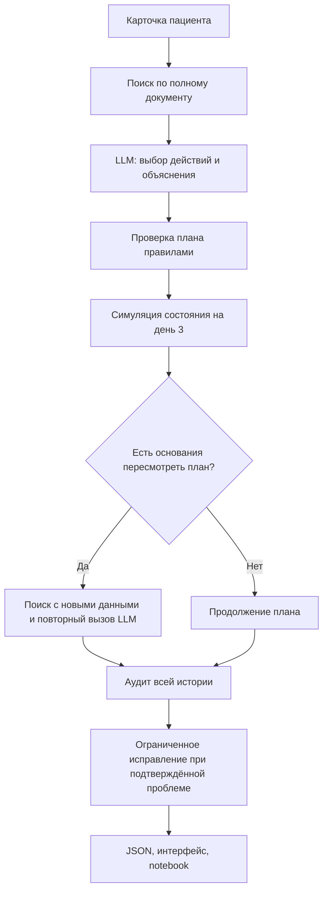

# Архитектура

Система принимает карточку пациента с установленным диагнозом, составляет план по рекомендациям, получает новые данные на третий день и проверяет итоговую историю. Оркестрация реализована через LangGraph, структуры данных — через Pydantic.

## Вход и выход

`Patient` содержит возраст, пол, диагноз, тяжесть, основание госпитализации, аллергии, сопутствующие состояния, препараты, измерения и посев. Каждое измерение имеет число, единицу и день. Для посева отдельно указаны дни забора и доступности результата. Пустой список аллергий означает отсутствие по данным случая; `null` — неизвестный анамнез.

Например, стартовая карточка содержит температуру 38,7 и ещё не содержит будущего результата посева. На третий день карточка дополняется новыми показателями и доступным результатом. Планировщик получает только сведения своего дня, без названия сценария симуляции.

Выход — `Trace`: исходная карточка, версии планов, контрольные точки, аудит, поисковые запросы и переходы. Каждый `PlanAction` содержит параметры, объяснение, статус и источники. Новая версия не перезаписывает старую.

## Подготовка документа и поиск

Зафиксирована редакция рекомендаций 2024 года, ID 654_2, объёмом 73 страницы. В `data/source/` сохранены PDF, извлечённый текст и сведения о происхождении. Номера страниц в источниках соответствуют физическим страницам PDF.

Весь извлечённый текст автоматически разбивается на фрагменты с перекрытием. Обработаны все 73 страницы: получено 98 текстовых фрагментов из 71 страницы и две записи о пустых страницах 72–73. Покрытие относится к текстовому слою PDF. Растровые схемы на страницах 7, 34, 41, 66, 67, 69 и 71 отдельно через OCR не распознаются. Поисковый индекс строится по этим фрагментам из `data/document_chunks.json`. В него попадают также разделы, которые не используются в трёх демонстрационных случаях.

Для текущих данных пациента программа формирует тематические запросы: стартовая терапия, обследования, аллергия, переоценка при отсутствии улучшения. BM25 ранжирует фрагменты по исходному тексту, без добавленных вручную заголовков и тегов. Соседние фрагменты добавляют контекст рекомендаций и таблиц. Запросы и результаты сохраняются в истории.

Отдельный файл `data/chunks.json` содержит 33 точные опорные выдержки. Они связывают найденный текст с проверенными действиями каталога. Выдержка используется как основание только когда соответствующий текст действительно присутствует в найденном контексте. Автоматического добавления всех источников каталога нет.

Дополнительные инструкции к препаратам и процедурные политики также доступны поиску и маркированы отдельно. Политику демонстрации нельзя принять за пункт клинических рекомендаций. Качество поиска измеряется отдельно от итогового выбора действий.

## Планирование

В live планировщик получает текущую карточку, найденные фрагменты и каталог допустимых действий. При пересмотре добавляются предыдущий план и новые события. Модель возвращает идентификаторы выбранных действий, объяснение каждого выбора, источники и недостающие данные.

Каталог содержит 15 вариантов: препараты, исследования, наблюдение, режим и повторную оценку. Параметры дозы, введения и частоты копируются из каталога. Модель выбирает действия по пациенту и найденным основаниям; предпочтительный стартовый препарат заранее промптом не задан.

Программа проверяет структуру ответа, существование действий, наличие оснований и соответствие ссылок. Ошибка выбора может вызвать одну ограниченную попытку исправления ответа. Ошибки API сохраняются как ошибки live.

В offline действия выбирает воспроизводимая эталонная политика. Такие планы имеют происхождение `fixture`; их результаты используются для регрессионных проверок, отдельно от качества LLM.

## Симуляция и пересмотр

Симулятор получает действующий план, пациента, сценарий и seed. Он создаёт показатели дня 3 по заданным веткам улучшения либо отсутствия улучшения. Ветка зависит от активного лечения и предусмотренной сценарием чувствительности. Это сценарная модель, без физиологического расчёта ответа.

У третьего пациента тестовый режим `resistant_to_active` задаёт отсутствие положительной динамики и посев с R к фактически активному препарату, S — к предусмотренным альтернативам. Это искусственно заданное событие для проверки пересмотра; результат доступен только на третий день. Эти новые факты вызывают пересмотр. У пациента с улучшением план продолжается без дополнительного вызова LLM-планировщика.

`execution_log` хранит события симуляции. Поле `sequence` задаёт порядок действий внутри дня, в частности забора материала и начала препарата. Назначенное исследование не считается полученным результатом.

Текущая демонстрация содержит одну контрольную точку. После пересмотра на третий день дальнейший исход не моделируется.

## Аудит и исправления

До симуляции план проверяют явные правила. Они покрывают формат, известные противопоказания, определённые взаимодействия, параметры каталога, ссылки и необходимые данные. При подтверждённой критической проблеме программа восстанавливает канонические параметры либо блокирует действие.

После продолжения или пересмотра отдельная LLM проверяет всю историю. Она получает состояния пациента по дням, фактические параметры планов, журнал событий, каталог и источники. У аудитора собственный поиск; дополнительно он явно загружает источники уже использованных действий и проверочные политики. Это отличается от планировщика: аудитор сверяет конкретные назначения с их основаниями, тогда как выбор нового действия требует найти основание поиском. Готовые заключения правил и метка намеренно внесённой ошибки ей не передаются. История сохраняет временную доступность фактов: результат дня 3 не должен ретроспективно превращать обоснованное решение дня 0 в ошибку.

Предположения модели сопоставляются с проверяемыми фактами. Подтверждение требует совпадения правила, версии плана, действия и источника. Подтверждённые замечания находятся в `findings`, остальные — в `unverified_findings`, результат проверки — в `llm_validation`. Исходная формулировка модели также сохраняется.

За пределами реализованных правил замечание остаётся непроверенным. Оно устанавливает `requires_human_review`, как и заблокированные действия или существенные неизвестные данные. Такой результат отличается от чистого аудита.

При актуальном подтверждённом критическом замечании допускается одно исправление и повторный аудит. Программа не добавляет вымышленные результаты анализов или согласия. Статус `resolved` относится к конкретной исправленной находке; первоначальный дефект остаётся в истории.

## Исполнение и просмотр

CLI запускает расчёт и сохраняет JSON. Streamlit и notebook показывают завершённые отчёты. Публичный интерфейс предоставляет просмотр; локальный также позволяет явно запустить новый расчёт.

Планировщик и аудитор используют отдельно заданные модели Mistral. Клиент ограничивает число запросов, повторы и длину ответа. Кэш привязан к полному запросу; метаданные фиксируют модель и происхождение ответа. Ключ хранится в окружении или локальном `.env` и исключён из Git.

`run_status.json` различает `running`, `complete` и `failed`. `summary.json` создаётся после завершения трёх случаев. Просмотр проверяет согласованность манифеста и файлов, чтобы не принять старый успешный результат за завершение нового неудачного запуска.

## Границы покрытия

Одна нозология, фиксированная редакция рекомендаций, 15 действий, три синтетических пациента и ограниченный набор взаимодействий. Полный документ участвует в поиске, но это не означает, что каталог поддерживает каждую найденную рекомендацию. Качество поиска, выбор действий, сценарная динамика и точность аудитора проверяются по отдельности.
